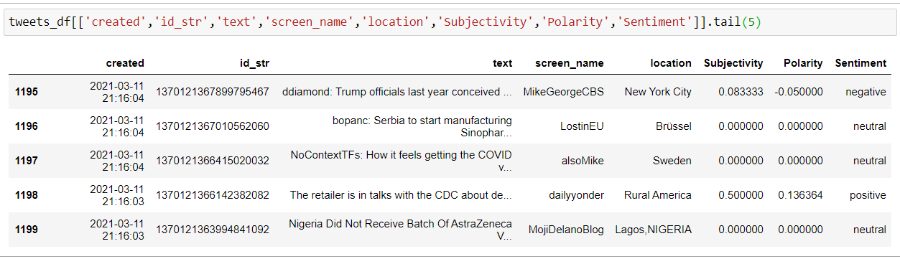

# COVID Vaccine Sentiments 
# Proposal 

### By: Nikita Case


### Goal
The goal of this project is to perform sentiment analysis of tweets relating to the COVID-19 Vaccines. These sentiments will be used along with geographical data to highlight areas of positive and negative sentiment across Canada and the USA. Retweets and likes will be analyzed to compare the popularity of positive vs negative tweets across the two countries

This data will be stored to an online database and deployed as a Flask app using Amazon Web Services (AWS). This will allow users to interact with visualizations that show:
* Where tweets are comming from
* Tweet sentiments (positive, negative and neutral)
* Popularity (based on likes and retweets) 


### Hypotheses

There will be more tweets with a positive than negative sentiment.

Positive tweets will be liked and retweeted more often than negative tweets.

Canada will have a higher percentage of positive to negative tweets than the USA


### How I plan to build this

##### Data Source
Twitter API version 1.1

##### Storage and Deployment
Amazon Web Services

##### Technology and Languages
* Python
* Pandas - 
* Tweepy - Library for accessing Twitter's API
* TextBlob  - For polarity and subjectivity scores
* Scipy - for statistical analysis
* SQLAlchemy - for CRUD
* Flask
* Flask SQLAlchemy - to load cleaned and analyzed data into flask app using various API routes
* JavaScript
* Plotly.js - To visualize positive vs negative tweet popularity acorss time and country
* Leaflet.js and Mapbox - To create interactive maps for data visualization
* HTML5 
* Bootstrap - because it's awesome


### How it Works

##### Data Collection

Tweets which meet the following criteria will be gathered: 
- Posted in English
- Mention the following: Covid Vaccine, Covid-19 Vaccine, Pfizer, Pfizer-BioNTech, Moderna or Astra Zeneca
- Are not themselves retweets

The Twitter API will be accessed using the Tweepy Module 

```python 
# Tweepy search parameters
search_terms = ['covid+vaccine OR covid-19+vaccine\ 
              OR pfizer OR pfizer-biontech OR pfizerbiontech\ 
              OR moderna \
              OR astrazeneca OR astra+zeneca \
              -filter:retweets']

# Tweet collection
tweets = tweepy.Cursor(api.search, max_id = max_id, lang ='en', q=search_terms, tweet_mode='extended').items(limit)
```

##### Transformation and Analysis

Text section of the tweet will be cleaned to remove @, # and hyperlinks

```python 

def CleanTweets(txt): 
    # remove @ from username
    txt = txt.replace('@','')    
    
    # remove RT    
    txt = re.sub(r'RT[\s]+','',txt)
    
    # remove # but leave txt
    txt = re.sub(r'#','', txt)
    
    # remove hyperlinks
    txt = re.sub(r'https?:\/\/\S+', '', txt)
    return txt
    
```

The text will then be rated in terms of subjectivity and polarity using the TextBlob module

```python 

# to get subjectivity 
def RateSubjectivity(txt):
    return TextBlob(txt).sentiment.subjectivity
    
# to get polarity
def RatePolarity(txt):
    return TextBlob(txt).sentiment.polarity
    
# add worded sentiment based on polarity score
def GetSentiment(num):
    if num < 0: 
        return 'negative' 
    elif num == 0:
        return 'neutral'
    else:
        return 'positive'
        
# Create Columns
def RateTweets(df):
    df['Subjectivity'] = df['text'].apply(RateSubjectivity)
    df['Polarity'] = df['text'].apply(RatePolarity)
    df['Sentiment'] = df['Polarity'].apply(GetSentiment)
    return df 

```

Section of analyzed dataset 




### Flask App

##### Connecting to database

```python 

# Create an engine for the database
# ------------------------------------------------------------------------------

engine = create_engine(conn, echo=False)   

# Reflect Database into ORM classes
# ------------------------------------------------------------------------------
Base = automap_base()
Base.prepare(engine, reflect=True)

```


##### Sample API 

```python
@app.route('/popularity')
def popularity():

    tweets = Base.classes.tweets
    session = Session(engine)
    
    lines = session.query(tweets.id_str, tweets.date, airlines.Sentiment, tweets.retweet_count, tweets.tweet_favourite_count).all()

    lined = {'timeline':[{
        'id_str': [col[0] for col in lines], 
        'date': [col[1] for col in lines], 
        'sentiment': [col[2] for col in lines],
        'retweets': [col[3] for col in lines],
        'likes': [col[4] for col in lines]
    }]}

    session.close()
    return jsonify(lined)
    
```


:smile_cat: Nikita Case

